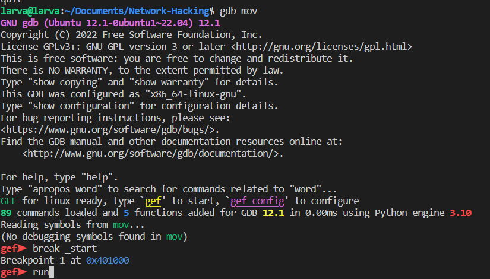
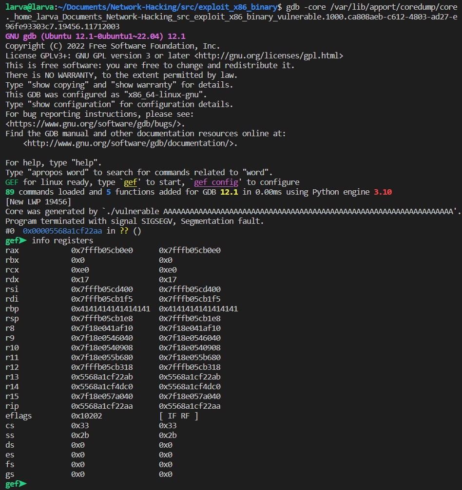

# Exploit Development for Linux (x86)

- Exploiting binaries that are written for x86 architecture.
- What will we do?
  - Writing shell code (Exit, Execve, Reverse TCP, etc.) using x86 assembly.
  - Implement techniques which exploit Vanilla Buffer overflows.
  - Identifying bad characters.
  - Debugging with GDB & GEF.
  - Bypassing NX (using Ret2Libc) & ASLR (using Bruteforce).
  - Return Oriented Programming.

- Install tools: NETCAT, GDB, GEF, NASM, LD, HEXDUMP, ROPPER.

```bash
bash -c "$(curl -fsSL https://gef.blah.cat/sh)"
```

## x86 Assembly fundamentals

### Registers

```text
|<---------------------------------64 bits------------------------------>|
|                                   RAX                                  |
                                     |<-------------32 bits------------->|
                                     |                EAX                |
                                                       |        AX       |
                                                       |<----16 bits---->|
                                                       |---AH---|---AL---|
                                                                |<8 bits>|
```

- General purpose registers:
  - RAX - EAX - AX - AH, AL
  - RBX - EBX - BX - BH, BL
  - RCX - ECX - CX - CH, CL
  - RDX - EDX - DX - DH, DL
  - RSI - ESI - Source Index
  - RDI - EDI - Destination Index
  - R8, R9, R10, R11, R12, R13, R14, R15
- Another registers:
  - RSP - ESP - Stack Pointer (Top of stack)
  - RBP - EBP - Base Pointer (Base current stack frame)
  - RIP - EIP - Instruction Pointer (Next instruction)

### mov Instruction

- Sample program:

```assembly
global _start

_start:
    mov eax, 0x8
    mov ebx, eax
    mov ecx, [esp]
```

- Build and run GDB/GEF:

```bash
nasm test.asm -f elf64 -o mov.o
ld mov.o -o mov
gdb mov
```

- Set breakpoint with symbol:

```gdb
break _start
```



- You can also set breakpoint with address:

```gdb
break *0x401005
```

- And run:


- We have five main components:
  - registers: contains registers and their values.
  - stack: address & value.
  - code
  - threads
  - trace

- List all breakpoints:

```gdb
info breakpoints
```


- Continue program:

```gdb
continue
```

- Run next single step:

```gdb
si
```

- GDB short commands:
  - break -> b
  - run -> r
  - continue -> c
  - etc.

### Access sub registers

- For example, you want to read `al` register, using `print` command:

```gdb
print $al
```

### ADD, SUB, INC, DEC instructions

```assembly
mov eax, 230
add eax, 1      ; Add eax by 1.

mov eax, 230
sub eax, 1      ; Sub eax by 1.

inc ebx         ; Increase ebx by 1.
dec ebx         ; Decrease ebx by 1.
```

### PUSH and POP instructions

```assembly
global _start

_start:
    mov eax, 0x8
    push rax        ; Push `rax` data to the stack.
    push 0x8

    pop rbx         ; Pop top of stack to `rbx`.
```

### CMP and JNE instructions

```assembly
global _start

_start:
    cmp rbx, 0x8        ; Zero flag is set if `rbx` equal 0x8.
    jne end             ; If Zero flag is not set, jump to `end` label.
    mov eax, 0x9
end:
    mov eax, 0x10
```


### CALL, LEAVE, RET instructions

- `call` vs `jmp`:
  - `jmp` command jump to label and cannot return to caller.
  - `call` jump to label and can back to caller by `ret` command.

## Stack Based Buffer Overflows

- Simple Stack based buffer overflow:
  - Vanilla Buffer Overflow using a vulnerable C program.
  - `strcpy` - no bounds checking.
  - Turn off all the exploit mitigation (NX, ASLR Stack canary)

- Flag `-fno-stack-protector`: Disable stack memory protection.
- Flag `-z execstack`: Allow executable on the stack memory.

- Disable ASLR by changing this file:

```bash
sudo bash -c "echo 0 > /proc/sys/kernel/randomize_va_space"
```

- Enable core dump file: `ulimit -c unlimited`
  - NOTE:
    - Check core dump config: `/proc/sys/kernel/core_pattern`
    - Depend your system or your config, the core dump file may be generated in current directory with `core` name. Or goto another directory: `/var/lib/apport/coredump/core._home_larva_Documents_Network-Hacking_src_exploit_x86_binary_vulnerable.1000.ca808aeb-c612-4803-ad27-e96fe93303c7.19456.11712003` or `/var/crash` or `/var/cache/abrt`.
    - Check log apport for more detail: `/var/log/apport.log`

- Run GDB with your core file to analyze crash:

```bash
gdb -core /var/lib/apport/coredump/core._home_larva_Documents_Network-Hacking_src_exploit_x86_binary_vulnerable.1000.ca808aeb-c612-4803-ad27-e96fe93303c7.19456.11712003
```

- Check state of registers: `info registers` You can see the `rip` hold invalid an address.



- Now, looking for our [vulnerable.cc](./vulnerable.cc) file with gdb. Disassembly the `vulnerable()` function with gdb command: `disass vulnerable`


- You can see we call `strcpy()`:

```text
0x00005555555552a3 <+346>:   call   0x555555555050 <strcpy@plt>
```

- Now run program with overflow payload argument:

```gdb
r $(cat payload)
```

- And `continue` until our program crashed:


